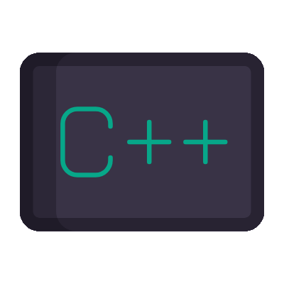
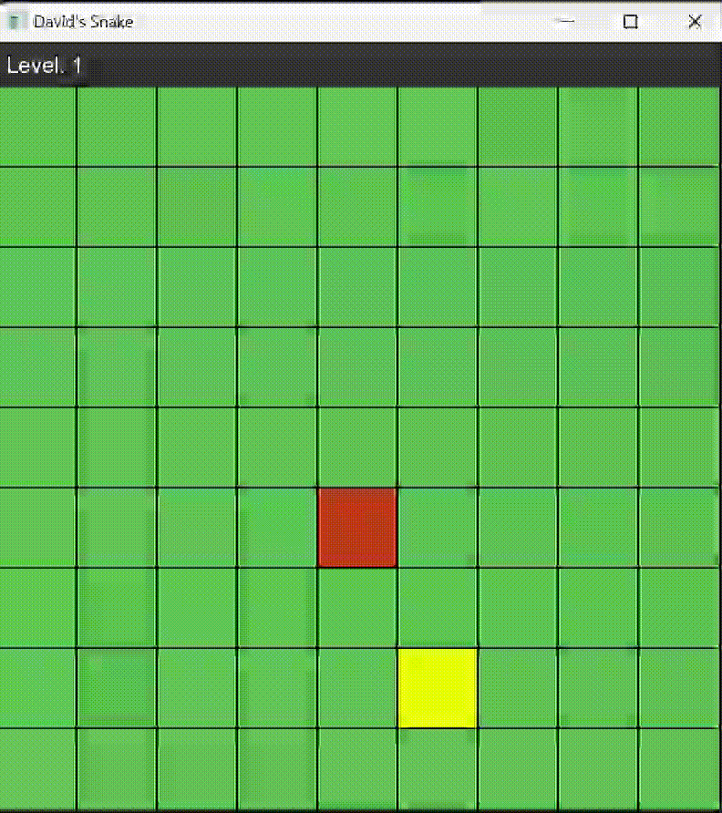

<h1>Snake Clone </h1>

  It has been a goal of mine for many years to program Snake. You know it, you played it on your flip-phone. 
   
  Not that it is necessarily a difficult game to program, but I figured it was a good introduction into graphical game development.
    
  I have made small games using the console before, but never anything with a GUI. To tackle that, I decided to 
   
  to use <a href="https://www.sfml-dev.org/index.php">SFML</a> as it seemed to have a low learning curve.
   
  In doing so, I learned game development fundamentals such as boundary checks, game states, and player movement. 
   
  I'm excited to see where it goes from here!

Programmed in C++ with the Simple and Fast Multimedia Library to handle the GUI. 
